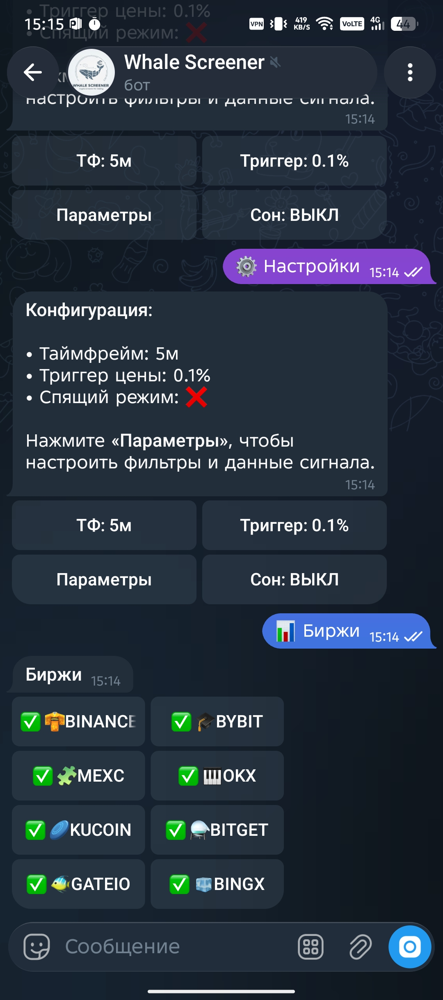
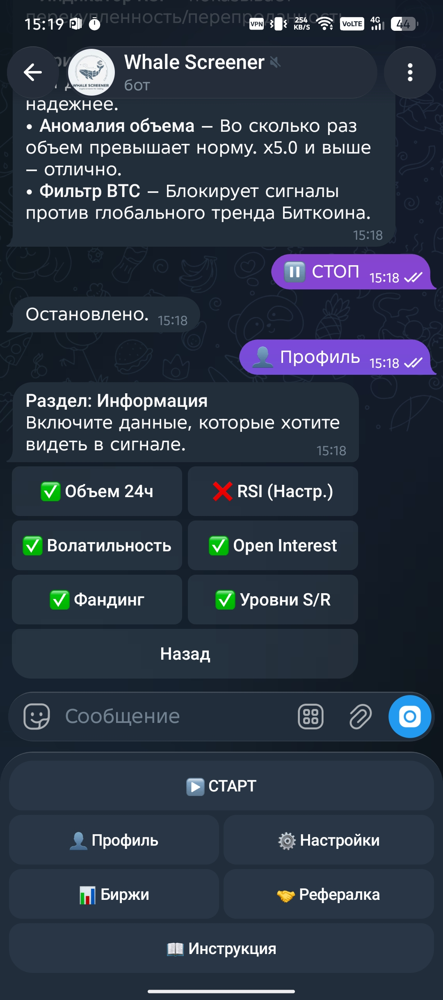
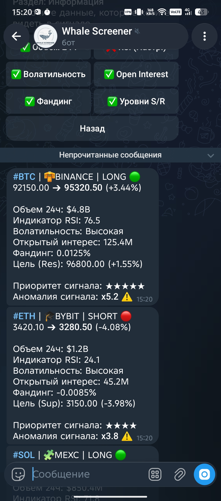

# Impulse Terminal

> An asynchronous, high-frequency cryptocurrency volatility & anomaly detection engine integrated with Telegram.

[](https://www.python.org/)
[](https://docs.aiogram.dev/)
[](https://github.com/ccxt/ccxt)
[](LICENSE)

---

## About The Project

In fast-moving cryptocurrency derivatives markets, tracking sharp price impulses and anomalous volume spikes across dozens of trading pairs and multiple exchanges manually is practically impossible. Traders frequently miss critical momentum shifts or buy into fakeouts without instant indicators context.

**Impulse Terminal** addresses this challenge by functioning as an automated, concurrent market scanner powered by `CCXT` and `aiogram 3.x`. It streams tickers in real time across 8 major derivatives exchanges, evaluates relative volume anomalies, calculates technical indicators (RSI, ATR volatility), extracts order book details (Funding Rates, Open Interest), and maps target Support/Resistance levels.

Designed with enterprise-ready scalability, the bot incorporates fine-grained notification management, timezone-aware sleep modes, and automated USDT payment monetization via `CryptoPay` with built-in referral rewards and multi-device double-spend protection.

---

## Key Features

- **Multi-Exchange Parallel Streaming**: Concurrent ticker ingestion from 8 major futures/swap platforms: Binance, Bybit, MEXC, OKX, KuCoin, Bitget, Gate.io, and BingX.
- **Deep Technical Contextualization**: Computes Volume Anomaly factors against rolling averages, RSI over customizable timeframes, ATR-driven volatility classifications, Open Interest, and Funding Rates.
- **BTC Trend & S/R Filtering**: Filters out counter-trend trades by monitoring real-time Bitcoin direction and calculates exact target distance to key Support and Resistance levels.
- **Built-in Crypto Pay Monetization**: Subscriptions powered by `AioCryptoPay` (USDT) featuring custom trial tracking, subscription expiration middlewares, and replay-attack transaction defense.
- **Referral Engine**: Integrated referral link generation granting automatic bonus access days to both referrers and new subscribers.
- **Granular User Control**: Full UI menu inside Telegram allowing custom timeframes (1m-30m), trigger percentage thresholds, exchange toggles, and UTC sleep schedule options.

---

## Screenshots

<p align="center">
  
  
  
</p>
---

## Architecture & Workflow

```
┌─────────────────────────────────────────────────────────────┐
│                   8 Exchange Web APIs                       │
│ (Binance, Bybit, MEXC, OKX, KuCoin, Bitget, Gate.io, BingX) │
└──────────────────────────────┬──────────────────────────────┘
                               │ (CCXT Async Ingestion)
                               ▼
┌─────────────────────────────────────────────────────────────┐
│                 MarketEngine Price Buffer                   │
│         Calculates Impulses, Volatility & Indicator Data    │
└──────────────────────────────┬──────────────────────────────┘
                               │
                               ▼
┌─────────────────────────────────────────────────────────────┐
│                  User Filter Matching                       │
│    Applies Thresholds, BTC Trend Filters & Sleep Windows    │
└──────────────────────────────┬──────────────────────────────┘
                               │
                               ▼
┌─────────────────────────────────────────────────────────────┐
│                   Telegram Bot Dispatcher                   │
│            Delivers Real-Time Alerts via Aiogram 3          │
└─────────────────────────────────────────────────────────────┘
```

---

## Setup & Local Installation Guide

### Prerequisites

- Python 3.10 or higher
- Telegram Bot Token (obtained from [@BotFather](https://t.me/BotFather))
- Crypto Pay API Token (obtained from [@CryptoBot](https://t.me/CryptoBot))

### Installation

1. **Clone the repository**
   ```bash
   git clone https://github.com/your-username/impulse-terminal.git
   cd impulse-terminal
   ```

2. **Create and activate a virtual environment**
   ```bash
   python -m venv venv
   source venv/bin/activate
   ```

3. **Install dependencies**
   ```bash
   pip install -r requirements.txt
   ```

4. **Configure Environment Variables**
   Create a `.env` file in the root directory:
   ```env
   BOT_TOKEN=123456789:ABCdefGHIjklMNOpqrsTUVwxyz
   CRYPTO_BOT_TOKEN=12345:AAAaaaBBBbbbCCCcccDDDddd
   ```

5. **Start the application**
   ```bash
   python main.py
   ```

---

## Tech Stack

- **Framework**: `aiogram` (v3.x)
- **Exchange Integration**: `ccxt.async_support`
- **Database**: `aiosqlite`
- **Data Analysis**: `pandas`, `numpy`
- **Payments**: `aiocryptopay`
- **Visualization**: `mplfinance`

---

## License

Distributed under the MIT License. See `LICENSE` for more information.
